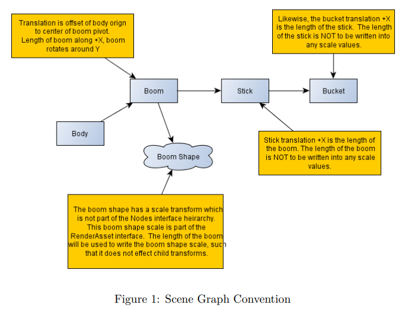
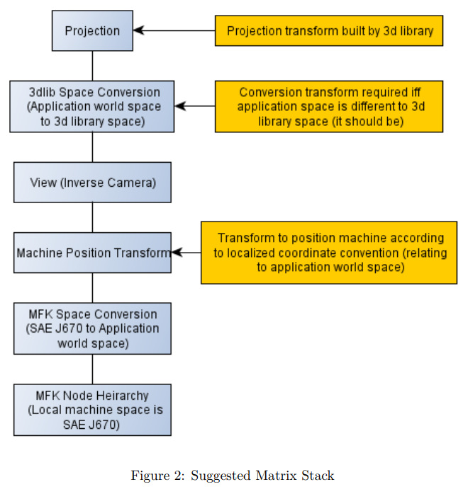

# Chapter 7  Machine Forward Kinematics (MFK)

_Machine Forward Kinematics_ (MFK) is used as an umbrella term to describe a
standard (and the code libraries and tools) used by various platforms to know
the location and shape of a machine on a Topcon SiteLink connected site.  The
purpose of MFK is to allow complex machine representation for varied goals, such
as being able to view a machine graphically on a web client, to decide implement
positions for as-built surface simulations, to determine points of interest in
machine simulation etc.  Whatever the need, the MFK standard and related
libraries allow knowing a machines location and shape in the distributed ad-hoc
SiteLink network.

The MFK standard also allows third party organizations such as Original
Equipment Manufacturers (OEM) to contribute machine position and shape
information to the Topcon SiteLink network without using Topcon source code.  
There are Topcon Libraries available to make the job easier, but by using the
MFK declarative specification we allow third party OEM’s to contribute to and
consume a SiteLink network using their existing code bases only.  The standard
is built on common technologies, making such a task less complex.  This move
toward an open platform allows for a heterogeneous work site, which is in-fact
the type of work site that we find in reality.

The term _Forward Kinematics_ (FK) is used because at the core of the
specification we find the Forward Kinematic terms used to express how a machine
is currently positioned in three space.  This is nothing more than the angles
between an excavator boom and stick for example.  It is this data that is sent
around the SiteLink network at high frequency, from client to server and server
to clients.   It is also a requirement that machine control applications use
_Inverse Kinematics_ (IK) to build the machine structure and shape from sensor
positions.  This aspect of machine control (IK) is not covered by the MFK
specification, as it is expected that each OEM already has this solution.

At the core of the technology group is a standard in
[JSON](http://www.json.org/).  JSON is useful for our MFK standard as it is more
human readable than xml, and it is a widely accepted data notation for Web
technologies.  Let’s get onto the _Machine Forward Kinematics_ (MFK) standard.

## The Resource Configuration

While the umbrella term for the library is _Machine Forward Kinematics_ we can
use the library to express many things on a work site, not just machines.  Boom
gates, range poles, crane arms etc. can all be modeled using the standard.  For
this reason, the root data type is called a _Resource Configuration_ and not a
Machine Configuration (as not all things are machines).  A
_Resource Configuration_ is the root node that describes a resource on a site
link work site.

A resource configuration is as follows:

~~~~{.json}
{
    "version": "0.1",
    "uuid": "b368a010-7110-11e2-bcfd-0800200c9a66",
    "description": "excavator",
    "resource_type ": "6ba7b810-9dad-11d1-80b4-00c04fd430c8",
    "components" :	[]
}
~~~~

We have not said very much here, just that a _Resource Configuration_ is
essentially a unique identifier, a base resource type and a list of components.

### Fields

#### Version

The version is used to indicate the version of the standard, which will be 0.1
until MFK is stabilized and peer reviewed.  The _Resource Configuration_ version
should change very infrequently, it is far more likely that Interface versions
(discussed later) might change with greater frequency than the
Resource Configuration version.  This version will **not** change with each
change to a resource description, such as changing the length of the machine. This
version will only change if the protocol changes, such as a new field is added
to the root JSON description.

#### UUID
Each resource configuration must be uniquely identified.  This UUID is created
by a machine control application for **any** change made to a resource
configuration.  So, if the length of a machine changes, or wear adjustment is
changed for the tracks of a bulldozer, then this UUID must be regenerated. Clients
may then cache a _Resource Configuration_ using this UUID as a cache key.

#### Description

The description is an English string to help people debugging get more
information about the configuration.  It is mostly intended as a human readable
debug aid.

#### Resource Type

The _Resource Type_ value is a UUID registered with Topcon for each type or
category of machine, such as “Excavator” or “Bulldozer”.  OEMs can register
their own UUIDs with Topcon. The UUID may be used to request more information
(translated display names etc) from the SiteLink network.  Please see the
_Resource Type_ table further in this document for the current registered types.

#### Components

The essential part of a _Resource Configuration_ is the components array. These
components represent discrete parts of a configuration. For example, a machine
may have several different bucket or drill components in addition to the main
machine body component.  A _Resource Configuration_ should always contain at
least one component which represents the main body of the machine.  It may then
contain additional components for each implement currently being used.

Note that machine control client software will build a _Resource Configuration_
each time an implement is changed, and change the configuration to represent the
new set of components that now represents the machine.  It is intended that
machine control software build a _Resource Configuration_ by loading and
composing known and well understood Components by the component UUID.  Each time
an operator changes an implement or measurement of a machine, the machine
control software should rebuild a _Resource Configuration_ with a unique UUID by
composing and configuring well known _Components_.

## Component

Components can be used to define machines and implements like drills or
buckets.  A component is very lightweight, and is best considered as simply a
collection of _Interfaces_.  It also has a UUID to help uniquely identify the
component.

~~~~{.json}
{
    "uuid": "b368a010-7110-11e2-bcfd-0800200c9a66",
    "description": "generic excavator",
    "interfaces": []
}
~~~~

### Fields

#### UUID

A component is uniquely identified by a UUID that is registered with Topcon.  By
doing this, OEM’s can register a component with Topcon, and the component
description becomes an immutable resource usable for composing a
_Resource Configuration_.  For example, Topcon may create a generic “bucket”
component for use with excavators.   The UUID ensures that each time a change
needs to be made to the generic “bucket” that no old statically compiled code
that depends on the old version of “bucket” will break.  

Components are uniquely identified with UUIDs as it is very much intended that a
registered component is a static, immutable resource.  This allows programmers
and artists alike to reason about them, and statically compile code and art
assets that makes assumptions about the structure of a component.  For example,
some code in a machine control product can load a component resource by UUID and
safely assume knowledge about the shape and structure of the nodes within the
component, such as the number of nodes in the hierarchy, the number and name of
the collision shapes etc.  

Finally, note that this UUID is unlike the _Resource Configuration_ UUID.  Where
the _Resource Configuration_ UUID changes with any change made, the _Component_
UUID is fixed for the component template.  If values within the component change
as a machine is measured and configured, the _Component_ UUID remains the
same.  The measured changes to the component are captured by the unique UUID
given to the parent _Resource Configuration_.

#### Description

The description field is intended as a human readable debug aid.

#### Interfaces

Each component has an array of interfaces.  The interfaces define the component
proper.

## Interface

Interfaces implement all the functionality of the MFK standard, and exist inside
components.  The MFK standard is extended by adding extra Interface definitions
to a Component.  For example, an OEM might release a new concept not yet
represented by MFK.  An Interface definition can be specified to represent this
new concept.

An interface is an independently versioned standard that may be released by
Topcon or by an OEM.  The bulk of our standard is implemented in a few key
interface objects.  Every interface has at least the following fields:

~~~~{.json}
{
    "oem ": "topcon",
    "name": "interface_name",
    "version": "0.1"
}
~~~~

Once again, we haven’t said very much here.  We simply have a way of uniquely
identifying an interface within the component’s interface array.

### Fields

#### Version

The version is used to indicate the version of the interface, which will be 0.1
until stabilized and peer reviewed.  Note that interfaces within the same
_Resource Configuration_ may be at different versions, depending on the OEM code
creating the interface.  Note that the interface version will only change if
the authoring OEM adds or removes fields, or changes the intended behavior of
an interface.  If the value of a field within an interface (such as the color
of a render mesh, or the volume of a bucket) changes, the version remains the
same, as such a change does not represent a change to the interface class.

#### OEM

The Originally Equipment Manufacturer (oem) field is a unique name registered
with Topcon.  Different OEM’s cannot share the same OEM name.  Topcon has
reserved the name “topcon” for their own interfaces.

Note: This field must not contain any ‘.’ characters.

#### Name

The name value is the unique interface name.  This name is unique within the
OEM.  Two different OEM’s can have an interface with the same name.  This means
the primary key, or unique identifier of an interface is the pair OEM name, and
interface name together.

Note: This field must not contain any ‘.’ characters.

### Referencing Values

Now that the basic Interface concept has been discussed, we can describe the
referencing mechanism used within the MFK specification.

Any JSON object within an interface JSON hierarchy may have an “id” value.  This
id must be unique within the interface JSON hierarchy.  For example:

~~~~{.json}
{
    "oem ": "topcon",
    "name": "weather",
    "version": "0.1",
    "values" :
    [
        {
            "id": "temperature",
            "value": 32.0
        },
        {
            "id": "humidity",
            "value": 87
        }
    ]
}
~~~~

This example shows that Topcon has a “weather” interface, which has two uniquely
named objects: “temperature” and “humidity”.

Any Interface can uniquely reference a value within any other interface in the
Component.  A value is uniquely identified by the following:

~~~~
<oem name>.<interface name>.<object id>.<value id>
~~~~

Thus, we could reference the humidity with the reference string:

~~~~
topcon.weather.humidity.value
~~~~

#### Note

For now, referenced values must be numbers (double).  Complex values such as
arrays or objects are not part of the initial standard.  This is to keep the MFK
standard simple for third parties to implement – specifically for implementation
in non dynamic languages such as c++.

#### Note

References must always successfully resolve when loading an MFK
configuration.  Any dangling reference will cause the configuration to fail
loading.  For statically complied languages, this might require the addition of
an “Unknown” interface object that can be used to represent values in an
interface not known to the static code.

# Interface Types

## Nodes Interface

The Nodes interface declares an articulated hierarchy for the Component.  It is
intended that we model the skeletal structure of a machine (such as the body,
boom, stick, bucket hierarchy in an excavator) using the nodes interface.  This
allows resource updates to send only the Forward Kinematic terms for boom angle,
stick angle etc to simulate the resource on remote clients.

~~~~{.json}
{
    "oem ": "topcon",
    "name": "nodes",
    "version": "0.1",
    "nodes":
    [
        {
            "id": "body",
            "tx": 0.0,
            "ty": 0.0,
            "tz": 0.0,
            "rx": 0.0,
            "ry": 0.0,
            "rz": 0.0,
            "sx": 1.0,
            "sy": 1.0,
            "sz": 1.0,
            "nodes":
            [
                {
                    "id": "boom",
                    "tx": 0.0,
                    "ty": 0.0,
                    "tz": 0.0,
                    "rx": 0.0,
                    "ry": 0.0,
                    "rz": 0.0,
                    "sx": 1.0,
                    "sy": 1.0,
                    "sz": 1.0,
                    "nodes":
                    [
                    ]
                }
            ]
        }
    ]
}
~~~~

Each node defines a translation, rotation and scale.  These are local (relative
to the parent node).  The coordinate space is SAE J670, right handed, z down
with front facing in positive X axis.   

**Note:** The order of rotation is rot(yaw) * rot(pitch) * rot(roll).  Logically
roll followed by pitch followed by yaw.

### Fields

#### Nodes

The nodes value is an Array of root nodes for the resource.  There can be more
than one root node, which may be independently positioned by the machine or
resource update packets.

### Referencing Nodes

Nodes within an interface must be uniquely named, so that they can be referenced
without needing to refer to the entire hierarchy that the referenced node
sits under. E.g. Despite being deep within the nodes hierarchy, an excavator’s
stick node would simply be referenced by:

~~~~
topcon.nodes.stick
~~~~

## Collision Shapes Interface

The Collision Shapes Interface may be used to represent an estimate volume of
the Component for the purpose of avoidance.  

The Collision Shapes interface currently has two shapes:

  * Axis-Aligned Bounding-Box (AABB)
  * Sphere

The Collision Shapes interface will most likely be extended to include:

  * Cylinder

Each collision shape references a Node from the Nodes Interface.

~~~~{.json}
{
    "oem": "topcon",
    "name": "collision_shapes",
    "version": "0.1",
    "shapes":
    [
        {
            "id": "stick",
            "type": "aabb|sphere",
            "node_ref": "topcon.nodes.stick",

            #center of the shape
            "cx": 0,
            "cy": 0,
            "cz": 0,

            #for a sphere
            "radius": 0,

            #half-extents for an aabb
            "hex": 0,
            "hey": 0,
            "hez": 0
        }
    ]
}
~~~~

## Measurements Interface

The _Measurements_ interface is an optional interface.  Its purpose is to
describe a set of named measurements, which would usually be obtained by using a
tape-measure on the physical machine component being described.  

More importantly, the _Measurements_ Interface describes how those measurements
are applied to the other Interface objects in a component.  For example, a
measurement called “boom_length” on an excavator might:

  * Set the half-extents-x and center-x of the boom collision axis box.
  * Set the translation-x of the “stick” Node.
  * Set the scale-x of Render transforms.
  * Possibly even adjust a shape scale for the referenced render asset.

~~~~{.json}
{
    "oem": "topcon",
    "name": "measurements",
    "version": "0.1",
    "measurements":
    [
        {
            "id": "body_length",
            "description": "horizontal distance front to back",
            "value": 7.0
        },
        {
            "id": "boom_hinge_front_offset",
            "description": "h.distance from front of body to hinge centre",
            "value": 1.5
        },
        {
            "id": "boom_hinge_base_offset",
            "description": "v.distance from base of body to hinge centre",
            "value": 1.6
        },
        {
            "id": "boom_length",
            "description": "centre of boom hinge to centre of stick hinge",
            "value": 11
        }
    ],
    "apply_measurements":
    "
        local m = mfk.topcon.measurements
        local n = mfk.topcon.nodes

        n.boom.tx = (m.body_length.value / 2) -
                       m.boom_hinge_front_offset.value
        n.boom.tz = -m.boom_hinge_base_offset.value
        n.stick.tx = m.boom_length.value
    "
}
~~~~

Note that the “apply_measurements” JSON string is a Lua script.  This Lua script
may be executed by a machine-control application to apply measurements entered
by a user to setup the configuration.  

In summary, the _Measurements_ interface becomes useful to fit, or apply the
measurements to the Component.  If it is not used by an MFK machine control
application, it serves as useful documentation as to what steps need to be
performed by the application to the Component when the measurements change for
the _Component_.

## AsBuilt Shapes Interface

This interface defines some shapes, relative to nodes in the nodes interface,
which can be used to modify the as-built surface.

~~~~{.json}
{
    "oem": "topcon",
    "name": "asbuilt_shapes",
    "version": "0.1",

    "shapes" :
    [
        {
            "id": "blade",
            "type": "line|quad",
            "vertices":
            [
                {
                    "point_ref": "topcon.points_of_interest.bucket_left",
                    "constants":
                    [
                        {
                            "function": "temp",
                            "value_ref": "topcon.raw_sensor.temp.value"
                        }
                    ]
                },
                {
                    "point_ref": "topcon.points_of_interest.bucket_right",
                    "constants":
                    [
                        {
                            "function": "temp",
                            "value_ref": "topcon.raw_sensor.temp.value"
                        }
                    ]
                }
            ],
            "functions":
            [
                "hght",
                "pass",
                "temp"
            ],
            "enabled": 1.0,
            "apply_when": 0.0
        }
    ]
}
~~~~

Note that each shape indicates a type, either “line” or “quad”.  A Line shape is
useful to represent leading cutting edge of buckets or blades, or the bottom
of roller drums.  A Quad shape is useful to represent larger footprints such as
the bottom of tracks etc. The Quad shape is now deprecated, future support will
be removed.

Each shape also lists a set of functions that are to be applied by the AsBuilt
update, as well as connections to other parts of the MFK specification using
the “constants” array.  Each constant provides a value reference to the value
that drives the constant for AsBuilt update purposes.  For example, a “temp”
constant might have a value reference to a temperature sensor.

## Replicate Interface

The _Replicate_ interface has a manifest of values within the Component DOM that
need to be replicated to represent the resource configuration remotely. The
manifest forms a "script" so-to-speak, where each value in the script (each
object in the manifest) is transformed from the DOM to the wire format, or from
the wire format and onto the DOM.

~~~~{.json}
{
    "oem ": "topcon",
    "name": "replicate",
    "version": "0.1",
    "manifest":
    [
        {
            "value_ref": "topcon.nodes.root.rz",
            "type": "float|double"
        }
        {
            "value_ref": "topcon.nodes.root.rz",
            "type": "int8|int16|int32",
            "discrete":
            {
                "min": -1.57079633,
                "max": +1.57079633,
                "discrete_min": -180
                "discrete_max": 180
            }                                
        }
    ]
}
~~~~

To use the replicate interface, the machine-control application must iterate
each Component in the component array in component order.  For each component,
the values in the manifest are iterated in order.  Each value is read from the
referenced location, and then transformed if there is a discrete object
present. Finally the value is serialized in a little-endian binary format into a
data buffer to transfer to other clients.

Upon receiving a _Replicate_ data buffer, other machine-control clients and
applications are expected to apply the buffer to the same _Resource
Configuration_ that was used to build the buffer.  The _Resource Configuration_
UUID may be used to ensure that the configuration used is the same.  The other
client reading the _Replicate_ data buffer must iterate the components and
manifest values in order and apply the discrete transform in the reverse
direction.

For each value in the manifest, the data type of the wire-format is
specified.  If the type is an integer (int8, int16, int32), a “discrete” object
may be specified to make the wire value discrete.

## Attach Interface

The attachment interface is used to connect hierarchies from different
components together.  An Attach hierarchy is placed in the child component.

The use of an Attach Interface allows clients to interpolate between updates.

The Attach Interface objects may form a hierarchy more than one level deep
(components attached to components attached to components).  For this reason,
clients are expected to build a dependency chain of attachments, and update Node
transforms according to the dependency order.

~~~~{.json}
{
    "oem": "topcon",
    "name": "attach",
    "version": "0.1",

    "parent_component_index": 0,
    "parent_node_ref": "topcon.nodes.stick",
    "local_node_ref": "topcon.nodes.root"
}
~~~~

## Render Asset Interface

This interface refers to the asset used to render the component that the
interface belongs to. The asset can be hosted by Topcon or an OEM. The assets
can also be built into a client side cache of the machine control application
such that an internet connection is not required to obtain the standard assets,
but the cache can be refreshed if there is an internet connection.

There are several things to consider when producing an asset for MFK.

  * Different asset types might be made available to support different end-user
    applications.  We may want to render an asset on a thin web client, or on a
    high-end rich client, or on a low spec embedded device.  To cope with this,
    we can specify different asset types
  * How are the scene graph transforms from the MFK hierarchy transferred to the
    render asset transform hierarchy?  This is a complex issue, but with a few
    conventions it can be made simpler.  These conventions are discussed below.
  * Different applications may desire different views of an asset, such as 3d,
    plan, profile etc.  Different assets may be required for different views.
  * Render asset interchange formats such as X3d, Collada, GeoJSON etc.  The
    long and short of it here is that there is no real winner in terms of a
    standard, and so we desire that an OEM should be able to even provide their
    own formats with associated MIME types to the SiteLink render asset
    repository. There is a requirement for each component that a few canonical
    (Collada 3d, plan, profile) assets be provided for each published Component
    UUID.
  * The model space of the client renderer will most likely not be in the model
    space of the MFK standard (SAE J670, right handed, z down with front facing
    in positive X axis).  A conversion will need to be applied by the client
    renderer.

### Transferring MFK Scene Graph Transform Hierarchy to the Render Asset Hierarchy

The following convention should be adopted when building MFK Scene Graph
hierarchy and render assets, in order to make configuring and rigging as easy as
possible.

Note the following:

  * NO scale is written into the node (transform) hierarchy.  Lengths of booms,
    offsets etc are written into translations of nodes.  The length of a boom for
    example, is written into the translation of the child stick transform.  This
    is in order to avoid scaling problems, and having to remove scale from child
    decendents.
  * There is a scale matrix for each shape described in the RenderAsset.  This
    shape matrix does not form part of the node hierarchy, to keep it simple.  The
    length of booms etc can safely be written into this shape scale without
    influencing the scale of child transforms.

Note the following:

  * A space conversion matrix will be needed as a parent of the MFK Nodes
    hierarchy, to convert from MFK J670 to the application world space.  We
    cannot choose a space that will suit all third party applications, so it is
    best to include a space conversion matrix.  There are examples in the MFK
    viewer for setting up this conversion matrix.
  * A machine positioning transform is required to place the machine in its
    correct world position.  This matrix is NOT to be the root MFK Nodes
    transform.  This is the case, because the MFK Nodes and Render Interfaces
    relate to machine space, not to the space of the application, and the world
    (global) positioning of the machine.  The machine position transform may
    involve WGS84, CECF, or some localized coordinate system.  This transform
    may be provided by the MFK Transform interface, or other transforms outside
    of the MFK standard.
  * An application may include a space conversion matrix between the projection
    matrix and view matrix, to transform application world space into the space
    required by the 3d library being used.  This is mentioned, because you must
    be aware of the handedness (left handed / right handed) of each of the
    spaces involved.  Any polygon drawn in one handedness must have its winding
    changed (or back face culling order flipped) if the final transform is in
    the other handedness.  

### Summary

  * MFK has only a limited interest in specifying the Northing, Easting, Height
    or heading, pitch, yaw of the machine in world space (See the Transform
    interface). Such a world-positioning transform should not be part of the
    Nodes or Render interfaces.
  * MFK examples will provide a method for building space conversion matricies
    in order to assist third parties in coping with the space changes
    involved.  There is a implicit scale transform between each shape in the
    RenderAsset interface and the Node interface transform that the shape
    attaches to.

~~~~{.json}
{
    "oem": "topcon",
    "name": "render_assets",
    "version": "0.2",
    "assets" :
    [
        {
            "view": "top|front|right|3d",
            "resource": [
                {
                    "mime_type": "model/vnd.collada+xml",
                    "href": "http://www.sitelink3d.net/mfk/render_assets/excavator.dae"
                }
            ],
            "shapes" :
            [
                {
                    "id": "top_body",     
                    "node_ref" : "topcon.nodes.body",
                    "asset_transform" : "BodyShape",
                    "asx": 5.1,
                    "asy": 5.1,
                    "asz": 5.1,
                    "sx": 2.1,
                    "sy": 2.1,
                    "sz": 2.1
                }
            ]
        }
    ]
}  
~~~~

Note the following about each shape:

  * The shape includes a reference to the parent node in the MFK Nodes interface
    (node_ref)
  * The shape includes a reference to the root node containing the shape in the
    authored art asset (asset_transform).
  * The shape includes information about its authored measurement.  This scale
    (asx,asy,asz) must be removed from the intended MFK measured scale
    (i.e., scale = MFK measured scale / authored asset scale).
  * The shape includes the intended MFK measured scale (sx,sy,sz).  The authored
     asset scale and the MFK measured scale together are used to build the
     implicit scale matrix of the shape.
  * The id of a shape should include the view as a namespace.  In other words, a
    “top” view body should be called something like “top_body” to ensure
     uniqueness of the shape id’s within the interface.

## Transform Interface

The Transform interface is used by Topcon to position a machine resource
relative to a global reference frame (surveyed reference station).  This allows
the Replicate interface to be used as a transport mechanism not only for the
local machine structure but also to position the machine on site.  Note that
there is no method of communicating the global reference frame.  It is expected
that this is made available at levels higher than MFK.

A Transform interface should only be placed on a component that is not attached
as a child to another component in a ResourceConfiguration.

~~~~{.json}
{
    "oem": "topcon",
    "name": "transform",
    "version": "0.1",
    "local_position" :
    {
        "id": "local_position",
        "northing": 0,
        "easting": 0,
        "elevation": 0
    },
    "local_rotation" :
    {
        "id": "local_rotation",
        "pitch": 0,
        "yaw": 0,
        "roll": 0
    }
}
~~~~

### Fields

#### Local Position

The local position provides a northing, easting and elevation.  These are
relative to the global referene frame, and in SI units (meters).

#### Local Rotation
The machine global orientation is in the Transform node and the rotation order is roll.pitch.yaw
(or yaw * pitch * roll).

# Resource Type Registry

The following resource type uuids are accepted in the standard.

resource_type UUID | Equipment type
------------------ | --------------------
748534a7-ce04-4ede-9f1a-50c5968c8b8c | Haul Truck
91db4037-bc13-445c-a565-08262da2fc74 | Excavator
2e5d82d9-3d94-4676-8bb6-00fae7d0cc5a | Asphalt Compactor
4eb63c87-8ed9-4382-9782-791daf000e21 | Asphalt Paver
022d8db4-716d-11e5-9942-37e3431c5379 | BullDozer
658ccbff-601a-48d9-85d6-2df2fe4fcd7a | Motor Grader
d70caae1-7baa-42bf-9b8f-138414dfcf6f | Snow Groomer

# Example

The following example represents an excavator with a bucket attached.

~~~~{.json}
{
	"version": "0.1",
	"uuid": "0213f001-cd3e-4e90-a004-6a6da201ea0c",
	"description": "Excavator client example",
	"resource_type": "91db4037-bc13-445c-a565-08262da2fc74",
	"components": [
		{
			"uuid": "63f91169-b0ab-4a28-86f1-05a6cb06f637",
			"description": "generic bucket",
			"interfaces": [
				{
					"oem": "topcon",
					"name": "asbuilt_shapes",
					"version": "0.1",
					"shapes": [
						{
							"id": "blade",
							"type": "line",
							"vertices": [
								{
									"point_ref": "topcon.points_of_interest.bucket_r",
									"constants": []
								},
								{
									"point_ref": "topcon.points_of_interest.bucket_l",
									"constants": []
								}
							],
							"functions": [
								"hght"
							],
							"enabled": 1,
							"apply_when": 4
						}
					]
				},
				{
					"oem": "topcon",
					"name": "attach",
					"version": "0.1",
					"parent_component_index": 1,
					"parent_node_ref": "topcon.nodes.stick_attach",
					"local_node_ref": "topcon.nodes.bucket"
				},
				{
					"oem": "topcon",
					"name": "collision_shapes",
					"version": "0.1",
					"shapes": [
						{
							"id": "bucket",
							"node_ref": "topcon.nodes.bucket",
							"type": "aabb"
						}
					]
				},
				{
					"oem": "topcon",
					"name": "measurements",
					"version": "0.1",
					"measurements": [
						{
							"id": "bucket_width",
							"description": "",
							"value": 1.1
						},
						{
							"id": "bucket_height",
							"description": "",
							"value": 0.8
						},
						{
							"id": "bucket_length",
							"description": "",
							"value": 1.5
						}
					],
					"apply_measurements_b64": "bG9jYWwgbSA9IG1may50b3Bjb24ubWVhc3VyZW1lbnRzDQoNCi0tIGNvbGxpc2lvbl9zaGFwZXMNCmxvY2FsIGNzID0gbWZrLnRvcGNvbi5jb2xsaXNpb25fc2hhcGVzDQoNCmNzLmJ1Y2tldC5oZXggPSBtLmJ1Y2tldF9sZW5ndGgudmFsdWUgLyAyDQpjcy5idWNrZXQuaGV5ID0gbS5idWNrZXRfd2lkdGgudmFsdWUgLyAyDQpjcy5idWNrZXQuaGV6ID0gbS5idWNrZXRfaGVpZ2h0LnZhbHVlIC8gMg0KY3MuYnVja2V0LmN4ID0gbS5idWNrZXRfbGVuZ3RoLnZhbHVlIC8gMg0KY3MuYnVja2V0LmN6ID0gLW0uYnVja2V0X2hlaWdodC52YWx1ZSAvIDINCg0KLS0gcG9pbnRzX29mX2ludGVyZXN0DQpsb2NhbCBwID0gbWZrLnRvcGNvbi5wb2ludHNfb2ZfaW50ZXJlc3QNCg0KcC5idWNrZXRfci50eCA9IG0uYnVja2V0X2xlbmd0aC52YWx1ZQ0KcC5idWNrZXRfci50eSA9IG0uYnVja2V0X3dpZHRoLnZhbHVlIC8gMg0KcC5idWNrZXRfbC50eCA9IG0uYnVja2V0X2xlbmd0aC52YWx1ZQ0KcC5idWNrZXRfbC50eSA9IC1tLmJ1Y2tldF93aWR0aC52YWx1ZSAvIDINCg0KLS0gcmVuZGVyIGFzc2V0cw0KbG9jYWwgciA9IG1may50b3Bjb24ucmVuZGVyX2Fzc2V0cw0KDQotLSAzZCB2aWV3DQpyLmJ1Y2tldF8zZC5zeCA9IG0uYnVja2V0X2xlbmd0aC52YWx1ZQ0Kci5idWNrZXRfM2Quc3kgPSBtLmJ1Y2tldF93aWR0aC52YWx1ZQ0Kci5idWNrZXRfM2Quc3ogPSBtLmJ1Y2tldF9oZWlnaHQudmFsdWUNCg0KLS0gdG9wIHZpZXcNCnIuYnVja2V0X3RvcC5zeCA9IG0uYnVja2V0X2xlbmd0aC52YWx1ZQ0Kci5idWNrZXRfdG9wLnN5ID0gbS5idWNrZXRfd2lkdGgudmFsdWUNCnIuYnVja2V0X3RvcC5zeiA9IG0uYnVja2V0X2hlaWdodC52YWx1ZQ0KDQotLSByaWdodCB2aWV3DQpyLmJ1Y2tldF9yaWdodC5zeCA9IG0uYnVja2V0X2xlbmd0aC52YWx1ZQ0Kci5idWNrZXRfcmlnaHQuc3kgPSBtLmJ1Y2tldF93aWR0aC52YWx1ZQ0Kci5idWNrZXRfcmlnaHQuc3ogPSBtLmJ1Y2tldF9oZWlnaHQudmFsdWUNCg0KLS0gZnJvbnQgdmlldw0Kci5idWNrZXRfZnJvbnQuc3ggPSBtLmJ1Y2tldF9sZW5ndGgudmFsdWUNCnIuYnVja2V0X2Zyb250LnN5ID0gbS5idWNrZXRfd2lkdGgudmFsdWUNCnIuYnVja2V0X2Zyb250LnN6ID0gbS5idWNrZXRfaGVpZ2h0LnZhbHVlDQo="
				},
				{
					"oem": "topcon",
					"name": "nodes",
					"version": "0.1",
					"nodes": [
						{
							"id": "bucket",
							"nodes": []
						}
					]
				},
				{
					"oem": "topcon",
					"name": "points_of_interest",
					"version": "0.1",
					"points": [
						{
							"id": "bucket_r",
							"description": "",
							"node_ref": "topcon.nodes.bucket"
						},
						{
							"id": "bucket_l",
							"description": "",
							"node_ref": "topcon.nodes.bucket"
						}
					]
				},
				{
					"oem": "topcon",
					"name": "render_assets",
					"version": "0.2",
					"assets": [
						{
							"view": "3d",
							"resource": [
								{
									"mime_type": "model/vnd.collada+xml",
									"href": "https://s3.amazonaws.com/sitelink-mfk/topcon/excavators/topcon/v1/3d/collada/excavator.dae"
								},
								{
									"mime_type": "model/gltf+json",
									"href": "https://s3.amazonaws.com/sitelink-mfk/topcon/excavators/topcon/v1/3d/gltf/excavator.gltf"
								},
								{
									"mime_type": "model/vnd.sitelink.mfk+json",
									"href": "https://s3.amazonaws.com/sitelink-mfk/topcon/excavators/topcon/v1/3d/mfkmesh/excavator.json"
								}
							],
							"shapes": [
								{
									"id": "bucket_3d",
									"node_ref": "topcon.nodes.bucket",
									"asset_transform": "Bucket3D",
									"asx": 1.471,
									"asy": 1.054,
									"asz": 0.822
								}
							]
						},
						{
							"view": "top",
							"resource": [
								{
									"mime_type": "model/vnd.collada+xml",
									"href": "https://s3.amazonaws.com/sitelink-mfk/topcon/excavators/topcon/v1/2d/collada/excavator.dae"
								},
								{
									"mime_type": "model/vnd.sitelink.mfk+json",
									"href": "https://s3.amazonaws.com/sitelink-mfk/topcon/excavators/topcon/v1/2d/mfkmesh/excavator.json"
								}
							],
							"shapes": [
								{
									"id": "bucket_top",
									"node_ref": "topcon.nodes.bucket",
									"asset_transform": "BucketTop_NC",
									"asx": 1.422,
									"asy": 0.881,
									"asz": 0.819
								}
							]
						},
						{
							"view": "right",
							"resource": [
								{
									"mime_type": "model/vnd.collada+xml",
									"href": "https://s3.amazonaws.com/sitelink-mfk/topcon/excavators/topcon/v1/2d/collada/excavator.dae"
								},
								{
									"mime_type": "model/vnd.sitelink.mfk+json",
									"href": "https://s3.amazonaws.com/sitelink-mfk/topcon/excavators/topcon/v1/2d/mfkmesh/excavator.json"
								}
							],
							"shapes": [
								{
									"id": "bucket_right",
									"node_ref": "topcon.nodes.bucket",
									"asset_transform": "BucketSide_NC",
									"asx": 1.472,
									"asy": 0.881,
									"asz": 0.819
								}
							]
						},
						{
							"view": "front",
							"resource": [
								{
									"mime_type": "model/vnd.collada+xml",
									"href": "https://s3.amazonaws.com/sitelink-mfk/topcon/excavators/topcon/v1/2d/collada/excavator.dae"
								},
								{
									"mime_type": "model/vnd.sitelink.mfk+json",
									"href": "https://s3.amazonaws.com/sitelink-mfk/topcon/excavators/topcon/v1/2d/mfkmesh/excavator.json"
								}
							],
							"shapes": [
								{
									"id": "bucket_front",
									"node_ref": "topcon.nodes.bucket",
									"asset_transform": "BucketFront_NC",
									"asx": 1.422,
									"asy": 0.881,
									"asz": 0.819
								}
							]
						}
					]
				},
				{
					"oem": "topcon",
					"name": "replicate",
					"version": "0.1",
					"manifest": [
						{
							"value_ref": "topcon.nodes.bucket.ry",
							"type": "int16",
							"discrete": {
								"min": -3.1415923,
								"max": 3.1415923,
								"discrete_min": -32768,
								"discrete_max": 32767
							}
						}
					]
				}
			]
		},
		{
			"uuid": "b368a010-7110-11e2-bcfd-0800200c9a66",
			"description": "generic excavator",
			"interfaces": [
				{
					"oem": "topcon",
					"name": "asbuilt_shapes",
					"version": "0.1",
					"shapes": [
						{
							"id": "tracks",
							"type": "quad",
							"vertices": [
								{
									"point_ref": "topcon.points_of_interest.base_rl",
									"constants": []
								},
								{
									"point_ref": "topcon.points_of_interest.base_fl",
									"constants": []
								},
								{
									"point_ref": "topcon.points_of_interest.base_fr",
									"constants": []
								},
								{
									"point_ref": "topcon.points_of_interest.base_rr",
									"constants": []
								}
							],
							"functions": [
								"hght"
							],
							"enabled": 1,
							"apply_when": 0
						},
						{
							"id": "tracks_pass",
							"type": "line",
							"vertices": [
								{
									"point_ref": "topcon.points_of_interest.base_fl",
									"constants": []
								},
								{
									"point_ref": "topcon.points_of_interest.base_fr",
									"constants": []
								}
							],
							"functions": [
								"pass"
							],
							"enabled": 1,
							"apply_when": 0
						}
					]
				},
				{
					"oem": "topcon",
					"name": "collision_shapes",
					"version": "0.1",
					"shapes": [
						{
							"id": "body",
							"node_ref": "topcon.nodes.body",
							"type": "aabb"
						},
						{
							"id": "boom",
							"node_ref": "topcon.nodes.boom",
							"type": "aabb"
						},
						{
							"id": "stick",
							"node_ref": "topcon.nodes.stick",
							"type": "aabb"
						},
						{
							"id": "tracks",
							"node_ref": "topcon.nodes.tracks",
							"type": "aabb"
						}
					]
				},
				{
					"oem": "topcon",
					"name": "measurements",
					"version": "0.1",
					"measurements": [
						{
							"id": "body_length",
							"description": "horizontal distance front to back",
							"value": 4.3
						},
						{
							"id": "body_width",
							"description": "horizontal distance left to right",
							"value": 2.8
						},
						{
							"id": "body_height",
							"description": "vertical distance bottom to top",
							"value": 3.0
						},
						{
							"id": "body_rotator_front_offset",
							"description": "horizontal distance from front of body back to the center of rotation above the tracks",
							"value": 1.35
						},
						{
							"id": "track_body_separation",
							"description": "vertical distance top of tracks up to bottom of body",
							"value": 0
						},
						{
							"id": "boom_hinge_right_offset",
							"description": "horizontal distance from right side of body to the hinge centre",
							"value": 1.4
						},
						{
							"id": "boom_hinge_front_offset",
							"description": "horizontal distance from front of body back to the hinge centre",
							"value": 1.35
						},
						{
							"id": "boom_hinge_base_offset",
							"description": "vertical distance from base of body to the hinge centre",
							"value": 0.75
						},
						{
							"id": "boom_length",
							"description": "from centre of boom hinge to centre of stick hinge",
							"value": 5.7
						},
						{
							"id": "boom_width",
							"description": "horizontal width of the boom member",
							"value": 0.4
						},
						{
							"id": "boom_height",
							"description": "vertical height of the boom member",
							"value": 1.25
						},
						{
							"id": "stick_length",
							"description": "from centre of stick hinge to centre of bucket hinge",
							"value": 2.9
						},
						{
							"id": "track_height",
							"description": "height of tracks to base",
							"value": 0.9
						},
						{
							"id": "track_length",
							"description": "length of tracks",
							"value": 3.4
						},
						{
							"id": "track_width",
							"description": "width of tracks",
							"value": 3.0
						}
					],
					"apply_measurements_b64": "bG9jYWwgbSA9IG1may50b3Bjb24ubWVhc3VyZW1lbnRzCgp3aGVlbGJhc2UgPSBtLnRyYWNrX2xlbmd0aC52YWx1ZSAtIG0udHJhY2tfaGVpZ2h0LnZhbHVlCgotLSBub2Rlcwpsb2NhbCBuID0gbWZrLnRvcGNvbi5ub2RlcwoKbi5ib29tLnR4ID0gbS5ib2R5X3JvdGF0b3JfZnJvbnRfb2Zmc2V0LnZhbHVlIC0gbS5ib29tX2hpbmdlX2Zyb250X29mZnNldC52YWx1ZQpuLmJvb20udHkgPSBtLmJvZHlfd2lkdGgudmFsdWUgLyAyIC0gbS5ib29tX2hpbmdlX3JpZ2h0X29mZnNldC52YWx1ZQpuLmJvb20udHogPSAtKG0uYm9vbV9oaW5nZV9iYXNlX29mZnNldC52YWx1ZSArIG0udHJhY2tfYm9keV9zZXBhcmF0aW9uLnZhbHVlICsgbS50cmFja19oZWlnaHQudmFsdWUpCgpuLnN0aWNrLnR4ID0gbS5ib29tX2xlbmd0aC52YWx1ZQpuLnN0aWNrX2F0dGFjaC50eCA9IG0uc3RpY2tfbGVuZ3RoLnZhbHVlCgotLSBjb2xsaXNpb25fc2hhcGVzCmxvY2FsIGNzID0gbWZrLnRvcGNvbi5jb2xsaXNpb25fc2hhcGVzCgpjcy5ib2R5LmhleCA9IG0uYm9keV9sZW5ndGgudmFsdWUgLyAyCmNzLmJvZHkuaGV5ID0gbS5ib2R5X3dpZHRoLnZhbHVlIC8gMgpjcy5ib2R5LmhleiA9IG0uYm9keV9oZWlnaHQudmFsdWUgLyAyCmNzLmJvZHkuY3ggPSBtLmJvZHlfcm90YXRvcl9mcm9udF9vZmZzZXQudmFsdWUgLSBtLmJvZHlfbGVuZ3RoLnZhbHVlIC8gMgpjcy5ib2R5LmN6ID0gLShtLnRyYWNrX2JvZHlfc2VwYXJhdGlvbi52YWx1ZSArIG0udHJhY2tfaGVpZ2h0LnZhbHVlKSAtIG0uYm9keV9oZWlnaHQudmFsdWUgLyAyCgpjcy5ib29tLmhleSA9IG0uYm9vbV93aWR0aC52YWx1ZSAvIDIKY3MuYm9vbS5oZXogPSBtLmJvb21faGVpZ2h0LnZhbHVlIC8gMgpjcy5ib29tLmhleCA9IG0uYm9vbV9sZW5ndGgudmFsdWUgLyAyCmNzLmJvb20uY3ggPSBtLmJvb21fbGVuZ3RoLnZhbHVlIC8gMgoKY3Muc3RpY2suaGV5ID0gbS5ib29tX3dpZHRoLnZhbHVlIC8gMgpjcy5zdGljay5oZXogPSBtLmJvb21faGVpZ2h0LnZhbHVlIC8gMgpjcy5zdGljay5oZXggPSBtLnN0aWNrX2xlbmd0aC52YWx1ZSAvIDIKY3Muc3RpY2suY3ggPSBtLnN0aWNrX2xlbmd0aC52YWx1ZSAvIDIKCmNzLnRyYWNrcy5jeiA9IC1tLnRyYWNrX2hlaWdodC52YWx1ZSAvIDIKY3MudHJhY2tzLmhleCA9IG0udHJhY2tfbGVuZ3RoLnZhbHVlIC8gMgpjcy50cmFja3MuaGV5ID0gbS50cmFja193aWR0aC52YWx1ZSAvIDIKY3MudHJhY2tzLmhleiA9IG0udHJhY2tfaGVpZ2h0LnZhbHVlIC8gMgoKLS0gcG9pbnRzX29mX2ludGVyZXN0CmxvY2FsIHAgPSBtZmsudG9wY29uLnBvaW50c19vZl9pbnRlcmVzdAoKcC5iYXNlX3JsLnR4ID0gLXdoZWVsYmFzZSAvIDIKcC5iYXNlX3JsLnR5ID0gLW0udHJhY2tfd2lkdGgudmFsdWUgLyAyCnAuYmFzZV9yci50eCA9IC13aGVlbGJhc2UgLyAyCnAuYmFzZV9yci50eSA9IG0udHJhY2tfd2lkdGgudmFsdWUgLyAyCnAuYmFzZV9mbC50eCA9IHdoZWVsYmFzZSAvIDIKcC5iYXNlX2ZsLnR5ID0gLW0udHJhY2tfd2lkdGgudmFsdWUgLyAyCnAuYmFzZV9mci50eCA9IHdoZWVsYmFzZSAvIDIKcC5iYXNlX2ZyLnR5ID0gbS50cmFja193aWR0aC52YWx1ZSAvIDIKCi0tIHJlbmRlciBhc3NldHMKbG9jYWwgciA9IG1may50b3Bjb24ucmVuZGVyX2Fzc2V0cwoKLS0gM2QgdmlldwpyLmdlYXJzXzNkLnN4ID0gbS50cmFja19sZW5ndGgudmFsdWU7CnIuZ2VhcnNfM2Quc3kgPSBtLnRyYWNrX3dpZHRoLnZhbHVlOwpyLmdlYXJzXzNkLnN6ID0gbS50cmFja19oZWlnaHQudmFsdWU7CgpyLnRyYWNrc19sZWZ0XzNkLnN4ID0gbS50cmFja19sZW5ndGgudmFsdWU7CnIudHJhY2tzX2xlZnRfM2Quc3kgPSBtLnRyYWNrX3dpZHRoLnZhbHVlOwpyLnRyYWNrc19sZWZ0XzNkLnN6ID0gbS50cmFja19oZWlnaHQudmFsdWU7CgpyLnRyYWNrc19yaWdodF8zZC5zeCA9IG0udHJhY2tfbGVuZ3RoLnZhbHVlOwpyLnRyYWNrc19yaWdodF8zZC5zeSA9IG0udHJhY2tfd2lkdGgudmFsdWU7CnIudHJhY2tzX3JpZ2h0XzNkLnN6ID0gbS50cmFja19oZWlnaHQudmFsdWU7CgpyLmJvZHlfM2Quc3ggPSBtLmJvZHlfbGVuZ3RoLnZhbHVlOwpyLmJvZHlfM2Quc3kgPSBtLmJvZHlfd2lkdGgudmFsdWU7CnIuYm9keV8zZC5zeiA9IG0uYm9keV9oZWlnaHQudmFsdWU7CgpyLmJvb21fM2Quc3ggPSBtLmJvb21fbGVuZ3RoLnZhbHVlOwpyLmJvb21fM2Quc3kgPSBtLmJvb21fd2lkdGgudmFsdWU7CnIuYm9vbV8zZC5zeiA9IG0uYm9vbV9oZWlnaHQudmFsdWU7CgpyLnN0aWNrXzNkLnN4ID0gbS5zdGlja19sZW5ndGgudmFsdWU7CnIuc3RpY2tfM2Quc3kgPSBtLnN0aWNrX2xlbmd0aC52YWx1ZSAvIHIuc3RpY2tfM2QuYXN4ICogci5zdGlja18zZC5hc3k7CnIuc3RpY2tfM2Quc3ogPSBtLnN0aWNrX2xlbmd0aC52YWx1ZSAvIHIuc3RpY2tfM2QuYXN4ICogci5zdGlja18zZC5hc3o7CgotLSB0b3AgdmlldwpyLmxlZnR0cmFja190b3Auc3ggPSBtLnRyYWNrX2xlbmd0aC52YWx1ZTsKci5sZWZ0dHJhY2tfdG9wLnN5ID0gbS50cmFja193aWR0aC52YWx1ZTsKci5sZWZ0dHJhY2tfdG9wLnN6ID0gbS50cmFja19oZWlnaHQudmFsdWU7CgpyLnJpZ2h0dHJhY2tfdG9wLnN4ID0gbS50cmFja19sZW5ndGgudmFsdWU7CnIucmlnaHR0cmFja190b3Auc3kgPSBtLnRyYWNrX3dpZHRoLnZhbHVlOwpyLnJpZ2h0dHJhY2tfdG9wLnN6ID0gbS50cmFja19oZWlnaHQudmFsdWU7CgpyLmJvZHlfdG9wLnN4ID0gbS5ib2R5X2xlbmd0aC52YWx1ZTsKci5ib2R5X3RvcC5zeSA9IG0uYm9keV93aWR0aC52YWx1ZTsKci5ib2R5X3RvcC5zeiA9IG0uYm9keV9oZWlnaHQudmFsdWU7CgpyLmJvb21fdG9wLnN4ID0gbS5ib29tX2xlbmd0aC52YWx1ZTsKci5ib29tX3RvcC5zeSA9IG0uYm9vbV93aWR0aC52YWx1ZTsKci5ib29tX3RvcC5zeiA9IG0uYm9vbV9oZWlnaHQudmFsdWU7CgpyLnN0aWNrX3RvcC5zeCA9IG0uc3RpY2tfbGVuZ3RoLnZhbHVlOwpyLnN0aWNrX3RvcC5zeSA9IG0uc3RpY2tfbGVuZ3RoLnZhbHVlIC8gci5zdGlja190b3AuYXN4ICogci5zdGlja190b3AuYXN5OwpyLnN0aWNrX3RvcC5zeiA9IG0uc3RpY2tfbGVuZ3RoLnZhbHVlIC8gci5zdGlja190b3AuYXN4ICogci5zdGlja190b3AuYXN6OwoKLS0gcmlnaHQgdmlldwpyLnRyYWNrc19yaWdodC5zeCA9IG0udHJhY2tfbGVuZ3RoLnZhbHVlOwpyLnRyYWNrc19yaWdodC5zeSA9IG0udHJhY2tfd2lkdGgudmFsdWU7CnIudHJhY2tzX3JpZ2h0LnN6ID0gbS50cmFja19oZWlnaHQudmFsdWU7CgpyLmJvZHlfcmlnaHQuc3ggPSBtLmJvZHlfbGVuZ3RoLnZhbHVlOwpyLmJvZHlfcmlnaHQuc3kgPSBtLmJvZHlfd2lkdGgudmFsdWU7CnIuYm9keV9yaWdodC5zeiA9IG0uYm9keV9oZWlnaHQudmFsdWU7CgpyLmJvb21fcmlnaHQuc3ggPSBtLmJvb21fbGVuZ3RoLnZhbHVlOwpyLmJvb21fcmlnaHQuc3kgPSBtLmJvb21fd2lkdGgudmFsdWU7CnIuYm9vbV9yaWdodC5zeiA9IG0uYm9vbV9oZWlnaHQudmFsdWU7CgpyLnN0aWNrX3JpZ2h0LnN4ID0gbS5zdGlja19sZW5ndGgudmFsdWU7CnIuc3RpY2tfcmlnaHQuc3kgPSBtLnN0aWNrX2xlbmd0aC52YWx1ZSAvIHIuc3RpY2tfcmlnaHQuYXN4ICogci5zdGlja19yaWdodC5hc3k7CnIuc3RpY2tfcmlnaHQuc3ogPSBtLnN0aWNrX2xlbmd0aC52YWx1ZSAvIHIuc3RpY2tfcmlnaHQuYXN4ICogci5zdGlja19yaWdodC5hc3o7"
				},
				{
					"oem": "topcon",
					"name": "nodes",
					"version": "0.1",
					"nodes": [
						{
							"id": "body",
							"nodes": [
								{
									"id": "boom",
									"nodes": [
										{
											"id": "stick",
											"nodes": [
												{
													"id": "stick_attach",
													"nodes": []
												}
											]
										}
									]
								},
								{
									"id": "tracks",
									"nodes": []
								}
							]
						}
					]
				},
				{
					"oem": "topcon",
					"name": "points_of_interest",
					"version": "0.1",
					"points": [
						{
							"id": "stick_attach",
							"description": "where the implement attaches to the stick",
							"node_ref": "topcon.nodes.stick_attach"
						},
						{
							"id": "base_rl",
							"description": "",
							"node_ref": "topcon.nodes.tracks"
						},
						{
							"id": "base_rr",
							"description": "",
							"node_ref": "topcon.nodes.tracks"
						},
						{
							"id": "base_fl",
							"description": "",
							"node_ref": "topcon.nodes.tracks"
						},
						{
							"id": "base_fr",
							"description": "",
							"node_ref": "topcon.nodes.tracks"
						}
					]
				},
				{
					"oem": "topcon",
					"name": "render_assets",
					"version": "0.2",
					"assets": [
						{
							"view": "3d",
							"resource": [
								{
									"mime_type": "model/vnd.collada+xml",
									"href": "https://s3.amazonaws.com/sitelink-mfk/topcon/excavators/topcon/v1/3d/collada/excavator.dae"
								},
								{
									"mime_type": "model/gltf+json",
									"href": "https://s3.amazonaws.com/sitelink-mfk/topcon/excavators/topcon/v1/3d/gltf/excavator.gltf"
								},
								{
									"mime_type": "model/vnd.sitelink.mfk+json",
									"href": "https://s3.amazonaws.com/sitelink-mfk/topcon/excavators/topcon/v1/3d/mfkmesh/excavator.json"
								}
							],
							"shapes": [
								{
									"id": "gears_3d",
									"node_ref": "topcon.nodes.tracks",
									"asset_transform": "RunningGear3D",
									"asx": 3.372,
									"asy": 2.8,
									"asz": 0.9
								},
								{
									"id": "tracks_left_3d",
									"node_ref": "topcon.nodes.tracks",
									"asset_transform": "TrackLeft",
									"asx": 3.372,
									"asy": 2.8,
									"asz": 0.9
								},
								{
									"id": "tracks_right_3d",
									"node_ref": "topcon.nodes.tracks",
									"asset_transform": "TrackRight",
									"asx": 3.372,
									"asy": 2.8,
									"asz": 0.9
								},
								{
									"id": "body_3d",
									"node_ref": "topcon.nodes.body",
									"asset_transform": "Cab3D",
									"asx": 4.277,
									"asy": 2.8,
									"asz": 2.970
								},
								{
									"id": "boom_3d",
									"node_ref": "topcon.nodes.boom",
									"asset_transform": "Boom3D",
									"asx": 5.69,
									"asy": 0.347,
									"asz": 1.261
								},
								{
									"id": "stick_3d",
									"node_ref": "topcon.nodes.stick",
									"asset_transform": "Stick3D",
									"asx": 2.91,
									"asy": 0.276,
									"asz": 0.695
								}
							]
						},
						{
							"view": "top",
							"resource": [
								{
									"mime_type": "model/vnd.collada+xml",
									"href": "https://s3.amazonaws.com/sitelink-mfk/topcon/excavators/topcon/v1/2d/collada/excavator.dae"
								},
								{
									"mime_type": "model/vnd.sitelink.mfk+json",
									"href": "https://s3.amazonaws.com/sitelink-mfk/topcon/excavators/topcon/v1/2d/mfkmesh/excavator.json"
								}
							],
							"shapes": [
								{
									"id": "lefttrack_top",
									"node_ref": "topcon.nodes.tracks",
									"asset_transform": "TrackLTop_NC",
									"asx": 4.35,
									"asy": 2.637,
									"asz": 0.81
								},
								{
									"id": "righttrack_top",
									"node_ref": "topcon.nodes.tracks",
									"asset_transform": "TrackRTop_NC",
									"asx": 4.35,
									"asy": 2.637,
									"asz": 0.81
								},
								{
									"id": "body_top",
									"node_ref": "topcon.nodes.body",
									"asset_transform": "BodyTop_NC",
									"asx": 4.288,
									"asy": 2.566,
									"asz": 3.04
								},
								{
									"id": "boom_top",
									"node_ref": "topcon.nodes.boom",
									"asset_transform": "BoomTop_NC",
									"asx": 5.58,
									"asy": 0.4,
									"asz": 1.4
								},
								{
									"id": "stick_top",
									"node_ref": "topcon.nodes.stick",
									"asset_transform": "StickTop_NC",
									"asx": 3.03,
									"asy": 0.4,
									"asz": 0.601
								}
							]
						},
						{
							"view": "right",
							"resource": [
								{
									"mime_type": "model/vnd.collada+xml",
									"href": "https://s3.amazonaws.com/sitelink-mfk/topcon/excavators/topcon/v1/2d/collada/excavator.dae"
								},
								{
									"mime_type": "model/vnd.sitelink.mfk+json",
									"href": "https://s3.amazonaws.com/sitelink-mfk/topcon/excavators/topcon/v1/2d/mfkmesh/excavator.json"
								}
							],
							"shapes": [
								{
									"id": "tracks_right",
									"node_ref": "topcon.nodes.tracks",
									"asset_transform": "TracksSide_NC",
									"asx": 3.441,
									"asy": 2.637,
									"asz": 0.81
								},
								{
									"id": "body_right",
									"node_ref": "topcon.nodes.body",
									"asset_transform": "BodySide_NC",
									"asx": 4.31,
									"asy": 2.566,
									"asz": 3.04
								},
								{
									"id": "boom_right",
									"node_ref": "topcon.nodes.boom",
									"asset_transform": "BoomSide_NC",
									"asx": 5.754,
									"asy": 0.4,
									"asz": 1.436
								},
								{
									"id": "stick_right",
									"node_ref": "topcon.nodes.stick",
									"asset_transform": "StickSide_NC",
									"asx": 2.878,
									"asy": 0.4,
									"asz": 0.601
								}
							]
						}
					]
				},
				{
					"oem": "topcon",
					"name": "replicate",
					"version": "0.1",
					"manifest": [
						{
							"value_ref": "topcon.nodes.boom.ry",
							"type": "int16",
							"discrete": {
								"min": -3.1415923,
								"max": 3.1415923,
								"discrete_min": -32768,
								"discrete_max": 32767
							}
						},
						{
							"value_ref": "topcon.nodes.stick.ry",
							"type": "int8",
							"discrete": {
								"min": -3.1415923,
								"max": 3.1415923,
								"discrete_min": -128,
								"discrete_max": 127
							}
						},
						{
							"value_ref": "topcon.nodes.stick_attach.ry",
							"type": "int8",
							"discrete": {
								"min": -3.1415923,
								"max": 3.1415923,
								"discrete_min": -128,
								"discrete_max": 127
							}
						},
						{
							"value_ref": "topcon.nodes.tracks.rz",
							"type": "float"
						},
						{
							"value_ref": "topcon.transform.local_position.northing",
							"type": "double"
						},
						{
							"value_ref": "topcon.transform.local_position.easting",
							"type": "double"
						},
						{
							"value_ref": "topcon.transform.local_position.elevation",
							"type": "float"
						},
						{
							"value_ref": "topcon.transform.local_rotation.pitch",
							"type": "float"
						},
						{
							"value_ref": "topcon.transform.local_rotation.yaw",
							"type": "float"
						},
						{
							"value_ref": "topcon.transform.local_rotation.roll",
							"type": "float"
						}
					]
				},
				{
					"oem": "topcon",
					"name": "transform",
					"version": "0.1",
					"local_position": {
						"id": "local_position",
						"northing": 0,
						"easting": 0,
						"elevation": 0
					},
					"local_rotation": {
						"id": "local_rotation",
						"roll": 0,
						"pitch": 0,
						"yaw": 0
					}
				}
			]
		}
	]
}
~~~~